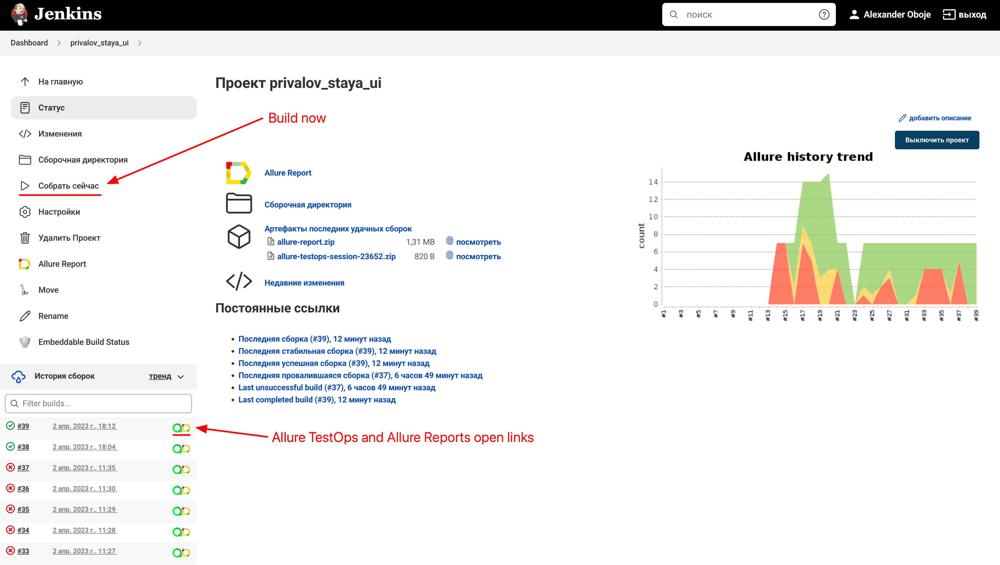
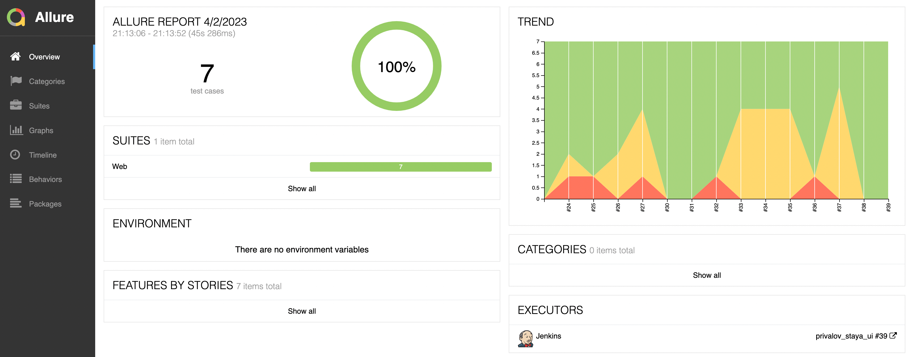
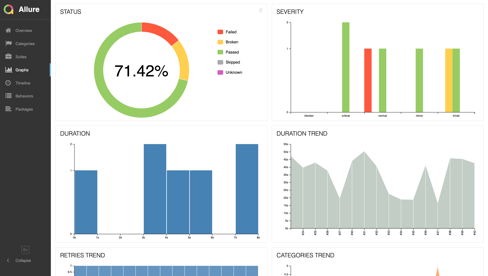
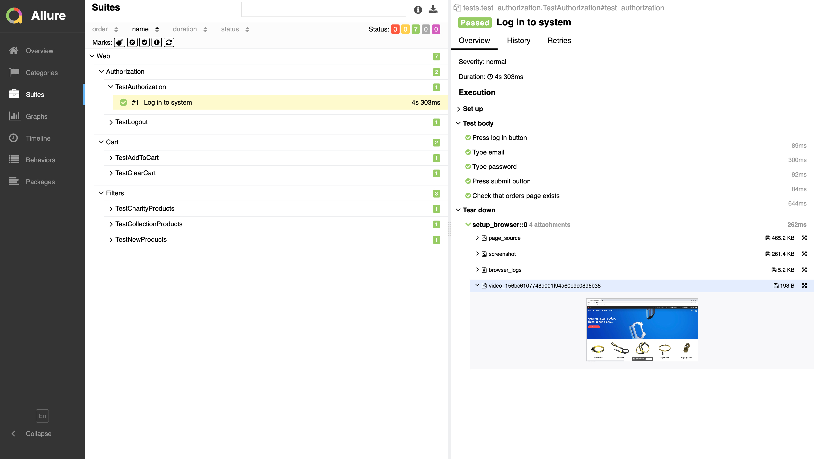
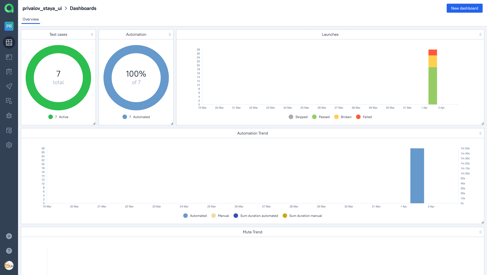
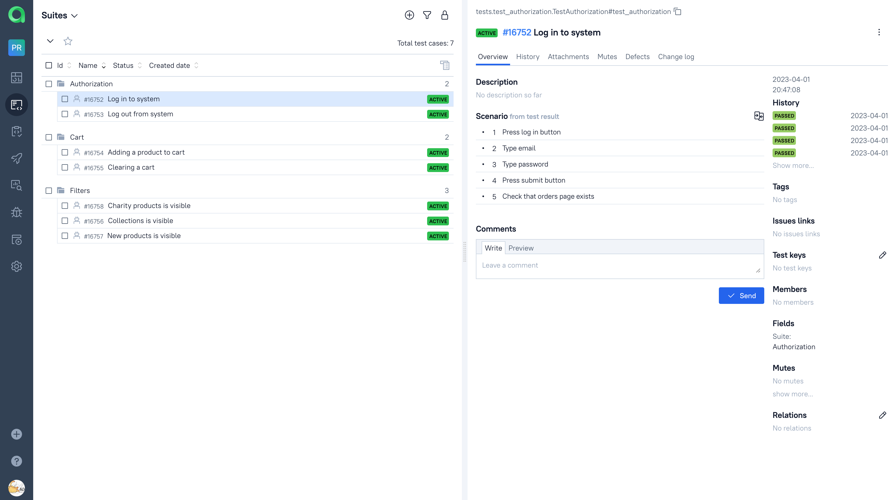
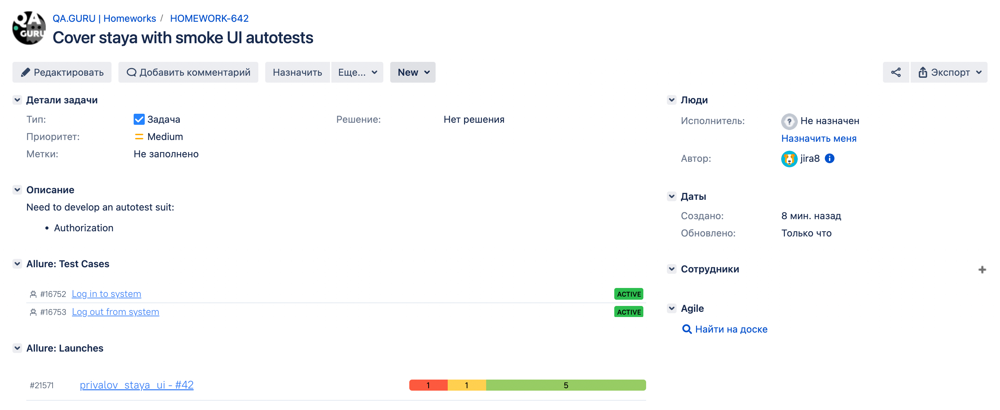
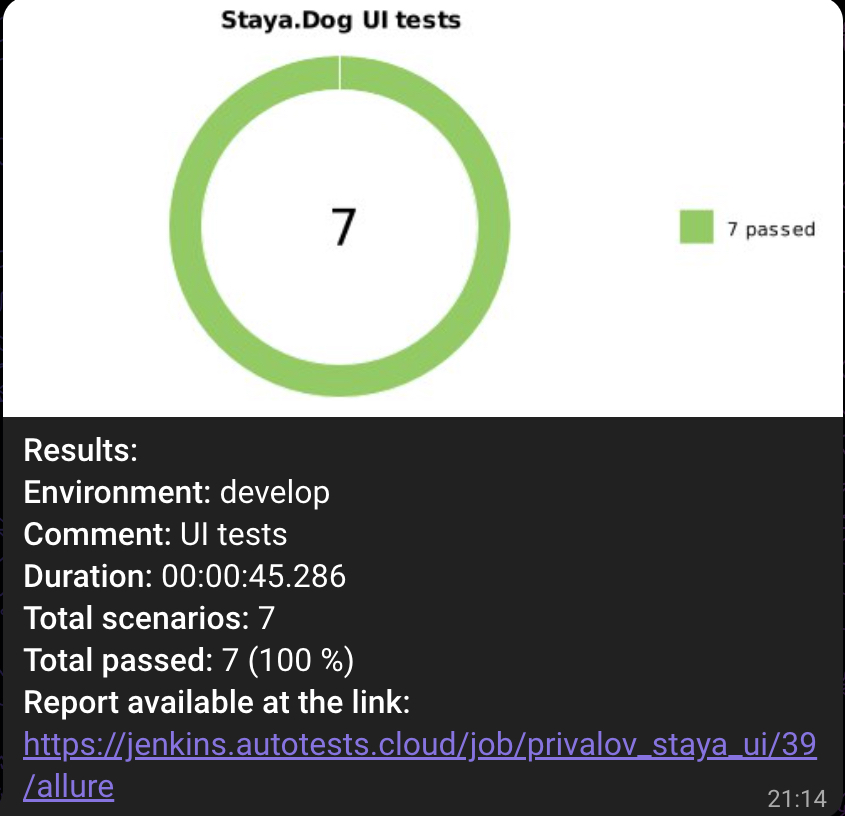

## Demo project of UI autotests for staya.dog

<!-- Technologies -->

### Used technologies

  <code></code>
  <code></code>
  <code></code>
  <code></code>
  <code></code>
  <code></code>
  <code></code>
  <code></code>
  <code></code>
  <code></code>
  <code></code>
  <code></code>
  <code></code>

<!-- Test cases -->

### Assertions
* Authorization - Log in
* Authorization - Log out
* Cart - Add product to cart
* Cart - Clear cart
* Filters - Show products by collections
* Filters - Show products by new
* Filters - Show products that participate in charity

<!-- Jenkins -->

###  Running the project in Jenkins.

### [Job](https://jenkins.autotests.cloud/job/privalov_staya_ui/)

##### Clicking "Build Now" will start building the tests and running them through a virtual machine in Selenoid.

<!-- Allure report -->

###  Allure report

##### After running the tests, the results can be viewed in the Allure report, which also contains a link to Jenkins.

##### In the Graphs tab, you can view graphs about test runs, prioritization, time to completion, etc.

##### In the Suites tab, you can find collected test cases, which include steps, logs, screenshots, and videos of test runs.

##### Video of test run

<!-- Allure TestOps -->

###  Integration with Allure TestOps

### [Dashboard](https://allure.autotests.cloud/project/2113/dashboards)

##### All reporting is also saved in Allure TestOps, where similar graphs are constructed.

#### In the Suites tab, we can:
* Manage all test cases or each one separately
* Restart each test case separately from all tests
* Configure integration with Jira
* Add manual tests, etc.

<!-- Jira -->

###  Jira Integration
##### By setting up integration with Jira through Allure TestOps, you can pass test run results and a list of test cases from Allure to a ticket.

<!-- Telegram -->

###  Telegram Integration
##### After running the tests, a message with a graph and some information about the tests is sent to a Telegram bot.

